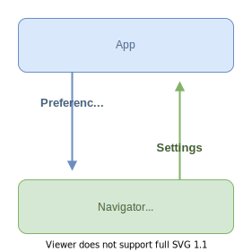

# Configuring the Navigator

Take a look at the [migration guide](../Migration%20Guide.md) if you are already using the legacy EPUB settings.

## Overview

The Readium Navigator can be configured dynamically, as it implements the `Configurable` protocol.

You cannot directly overwrite the Navigator settings. Instead, you submit a set of `Preferences` to the Navigator, which will then recalculate its settings and update the presentation.

For instance: "font size" is a **setting**, and the application can submit the font size value `150%` as a **preference**.



```swift
// 1. Create a set of preferences.
let preferences = EPUBPreferences(
    fontFamily: .serif,
    fontSize: 2.0,
    publisherStyles: false
)

// 2. Submit the preferences, the Navigator will update its settings and the presentation.
epubNavigator.submitPreferences(preferences)

// 3. Read the new settings.
assert(epubNavigator.settings.fontFamily == .serif)
```

### Editing preferences

To assist you in building a preferences user interface or modifying existing preferences, navigators can offer a `PreferencesEditor`. Each implementation includes rules for adjusting preferences, such as the supported values or ranges.

```swift
// 1. Create a preferences editor.
let editor = epubNavigator.editor(of: preferences)
    
// 2. Modify the preferences through the editor.
editor.fontFamily.set(.serif)
editor.fontSize.increment()
editor.publisherStyles.toggle()

// 3. Submit the edited preferences.
epubNavigator.submitPreferences(editor.preferences)
```

### Preferences are low-level

Preferences are low-level technical properties. While some of them can be exposed directly to the user, such as the font size, others should not be displayed as-is.

For instance, in EPUB, we can simulate two pages side by side using the `columnCount` (`auto`, `1`, `2`) property for reflowable resources, and the `spread` (`auto`, `never`, `always`) property for fixed-layout publications. Rather than displaying both of these settings with all of their possible values in the user interface, you might prefer to show a single switch button to enable a dual-page mode, which will set both settings appropriately.

### Inactive settings

A setting may be inactive if its activation conditions are not met in a set of preferences. The Navigator will ignore inactive settings when updating its presentation. For example, with the EPUB navigator, the word spacing setting requires the publisher styles to be disabled in order to take effect.

You can check if a setting is effective for a set of preferences using the `PreferencesEditor`:

```swift
let editor = epubNavigator.editor(of: preferences)
editor.wordSpacing.isEffective
```

## Setting the initial Navigator preferences and app defaults

When opening a publication, you can immediately apply the user preferences by providing them to the Navigator constructor. The API for doing this varies depending on the Navigator implementation, but generally looks like this:

```swift
let navigator = try EPUBNavigatorViewController(
    publication: publication,
    config: .init(
        preferences: EPUBPreferences(
            language: Language(code: "fr")
        ),
        defaults: EPUBDefaults(
            pageMargins: 1.5,
            scroll: true
        )
    )
)
```

The `defaults` are used as fallback values when the default Navigator settings are not suitable for your application.

## Build a user settings interface

:question: The following examples use SwiftUI, but could be implemented using UIKit as well.

### `PreferencesEditor`

Although you could create and modify `Preferences` objects directly before submitting them to the Navigator, a `PreferenceEditor` can assist you by providing helpers for dealing with each preference type when building the user interface.

`PreferencesEditor` implementations are specific to each Navigator, but they all provide `Preference<Value>` properties for every setting (e.g. theme or font size). 

### `UserPreferences` view

You can use the `PreferencesEditor` type to determine which (media type agnostic) view to create.

```swift
struct UserPreferences<
    P: ConfigurablePreferences,
    E: PreferencesEditor
>: View where E.Preferences == P {

    let editor: E
    let commit: () -> Void

    @ViewBuilder var body: some View {
        List {
            Button("Reset") {
                editor.clear()
                commit()
            }

            switch editor {
            case let editor as PDFPreferencesEditor:
                fixedLayoutUserPreferences(
                    commit: commit,
                    backgroundColor: editor.backgroundColor,
                    readingProgression: editor.readingProgression,
                    scroll: editor.scroll,
                    ...
                )

            case let editor as EPUBPreferencesEditor:
                switch editor.layout {
                case .reflowable:
                    reflowableUserPreferences(
                        commit: commit,
                        backgroundColor: editor.backgroundColor,
                        columnCount: editor.columnCount,
                        fontFamily: editor.fontFamily,
                        ...
                    )
                case .fixed:
                    fixedLayoutUserPreferences(
                        commit: commit,
                        backgroundColor: editor.backgroundColor,
                        readingProgression: editor.readingProgression,
                        ...
                    )
                }

            default:
                fatalError("Unsupported preferences editor.")
            }
        }
    }
}
```

The `commit` parameter is a closure used to save the edited preferences to the data store, before submitting them to the Navigator.

:question: The individual `PDFPreferencesEditor` properties are passed to `fixedLayoutUserPreferences()` so that it can be reused with other fixed-layout publication types, such as FXL EPUB or comic books. This is useful to reuse the user interface for similar publication types.

### User settings view for fixed-layout publications

This stateless view displays the actual preferences for a fixed-layout publication. The `Preference` parameters are nullable as they might not be available for all publication types. It delegates the rendering of individual preferences to more specific views.

```swift
@ViewBuilder func fixedLayoutUserPreferences(
    commit: @escaping () -> Void,
    scroll: AnyPreference<Bool>? = nil,
    fit: AnyEnumPreference<ReadiumNavigator.Fit>? = nil,
    pageSpacing: AnyRangePreference<Double>? = nil
) -> some View {
    if let scroll = scroll {
        toggleRow(
            title: "Scroll",
            preference: scroll,
            commit: commit
        )
    }

    if let fit = fit {
        pickerRow(
            title: "Fit",
            preference: fit,
            commit: commit,
            formatValue: { v in
                switch v {
                case .cover: return "Cover"
                case .contain: return "Contain"
                case .width: return "Width"
                case .height: return "Height"
                }
            }
        )
    }

    if let pageSpacing = pageSpacing {
        stepperRow(
            title: "Page spacing",
            preference: pageSpacing,
            commit: commit
        )
    }
}
```

### View for a boolean `Preference`

A `Preference<Bool>` can be represented as a simple toggle button.

```swift
@ViewBuilder func toggleRow(
    title: String,
    preference: AnyPreference<Bool>,
    commit: @escaping () -> Void
) -> some View {
    Toggle(title,
        isOn: Binding(
            get: { preference.value ?? preference.effectiveValue },
            set: { checked in
                preference.set(checked)
                commit()
            }
        )
    )
}
```

For convenience, you could add a custom extension to create a SwiftUI `Binding` from a `Preference`. 

```swift

Toggle(title,
    isOn: preference.binding(onSet: commit)
)

extension Preference {

    /// Creates a SwiftUI binding to modify the preference's value.
    ///
    /// This is convenient when paired with a `Toggle` or `Picker`.
    func binding(onSet: @escaping () -> Void = {}) -> Binding<Value> {
        Binding(
            get: { value ?? effectiveValue },
            set: { set($0); onSet() }
        )
    }
}
```

### `value` vs `effectiveValue`, which one to use?

In the previous example, you may have noticed the use of `preference.value ?? preference.effectiveValue` for the current value.

* `value` holds the user-selected preference, which may be `nil`.
* `effectiveValue` is the setting value that will actually be used by the Navigator once the preferences are submitted. It may be different from the user-selected value if it is incompatible or invalid.

This is a common pattern with this API because it is less confusing to display the user-selected value, even if it will not actually be used by the Navigator.

### View for a `RangePreference<Value>`

A `RangePreference<Value>` can be represented as a stepper component with decrement and increment buttons.

```swift
@ViewBuilder func stepperRow<V: Comparable>(
    title: String,
    preference: AnyRangePreference<V>,
    commit: @escaping () -> Void
) -> some View {
    Stepper(
        onIncrement: {
            preference.increment()
            commit()
        },
        onDecrement: {
            preference.decrement()
            commit()
        }
    ) {
        HStack {
            Text(title)

            Spacer()

            Text(preference.format(value: preference.value ?? preference.effectiveValue))
                .font(.caption)
        }
    }
}
```

This view uses the `increment()` and `decrement()` range helpers of `RangePreference`, but it is also possible to set a value manually.

The current value is displayed after formatting it with the `RangePreference.format(value:)` helper. This will automatically format the value to a human-readable string, such as a percentage or a value with units (e.g. 30px).

### View for an `EnumPreference<Value>`

An `EnumPreference<Value>` is a preference accepting a closed set of values. This is a great candidate to use a [`Picker`](https://developer.apple.com/documentation/swiftui/picker) view with different styles depending on the value set.

* a `menu` for a large enum
* a `radioGroup` or `segmented` buttons for a small one

In the following example, the `Picker` is built with `preference.supportedValues`, which returns the allowed enum members.

```swift
@ViewBuilder func pickerRow<V: Hashable>(
    title: String,
    preference: AnyEnumPreference<V>,
    commit: @escaping () -> Void,
    formatValue: @escaping (V) -> String
) -> some View {
    Picker(title, selection: preference.binding(onSet: commit)) {
        ForEach(preference.supportedValues, id: \.self) {
            Text(formatValue($0)).tag($0)
        }
    }
}
```

> [!NOTE]
> Contrarily to a `RangePreference`, there's no intrinsic `format(value:)` helper for an `EnumPreference`. Instead, you must provide your own localized strings for the possible values.

```swift
pickerRow(
    title: "Reading progression",
    preference: readingProgression,
    commit: commit,
    formatValue: { v in
        switch v {
        case .ltr: return "LTR"
        case .rtl: return "RTL"
        }
    }
)
```

## Save and restore the user preferences

Having a user settings screen is not useful if you cannot save and restore the selected preferences for future sessions. All `Preferences` types implement the `Codable` protocol and can be serialized to and from JSON.

```swift
let jsonData = try JSONEncoder().encode(preferences)
```

When you are ready to restore the user preferences, construct a new `Preferences` object from the JSON data.

```swift
let preferences = try JSONDecoder().decode(EPUBPreferences.self, from: jsonData)
```

In the Test App, `UserPreferencesViewModel` delegates the preferences persistence to a `UserPreferencesStore`. The preferences are observed from the store to automatically submit updated preferences to the navigator and refresh the user interface.

### Splitting and merging preferences

The way you store user preferences can affect the available features. You could have, for example:

* A unique set of preferences for each publication.
* Preferences shared between publications with the same profile or media type (EPUB, PDF, etc.).
* Global preferences shared with all publications (e.g. theme).
* Several user setting profiles/themes that the user can switch between and modify independently.
* Some settings that are not stored as JSON and will need to be reconstructed (e.g. the publication language).

To assist you, the toolkit provides suggested filters for each `Preferences` type, to extract the preferences intrinsic to a publication.

```swift
let publicationPrefs = preferences.filterPublicationPreferences()
let sharedPrefs = preferences.filterSharedPreferences()

// You can reconstruct the original preferences by combining the filtered ones.
let combinedPrefs = publicationPrefs.merging(sharedPrefs)
```

> [!TIP]
> Some preferences are closely tied to a specific publication and should never be shared between multiple publications, such as the language. It is recommended that you store these preferences separately per book, which is what the suggested filters will do if you use them.

## Appendix: Preference constraints

### EPUB

#### Reflowable vs fixed-layout

EPUB comes in two very different flavors: **reflowable** which allows a lot of customization, and **fixed-layout** which is similar to a PDF or a comic book. Depending on the EPUB being rendered, the Navigator will ignore some of the preferences.

| Setting              | Reflowable         | Fixed Layout       |
|----------------------|--------------------|--------------------|
| `backgroundColor`    | :white_check_mark: | :white_check_mark: |
| `columnCount`        | :white_check_mark: |                    |
| `fontFamily`         | :white_check_mark: |                    |
| `fontSize`           | :white_check_mark: |                    |
| `fontWeight`         | :white_check_mark: |                    |
| `hyphens`            | :white_check_mark: |                    |
| `imageFilter`        | :white_check_mark: |                    |
| `language`           | :white_check_mark: | :white_check_mark: |
| `letterSpacing`      | :white_check_mark: |                    |
| `ligatures`          | :white_check_mark: |                    |
| `lineHeight`         | :white_check_mark: |                    |
| `pageMargins`        | :white_check_mark: |                    |
| `paragraphIndent`    | :white_check_mark: |                    |
| `paragraphSpacing`   | :white_check_mark: |                    |
| `publisherStyles`    | :white_check_mark: |                    |
| `readingProgression` | :white_check_mark: | :white_check_mark: |
| `scroll`             | :white_check_mark: |                    |
| `spread`             |                    | :white_check_mark: |
| `textAlign`          | :white_check_mark: |                    |
| `textColor`          | :white_check_mark: |                    |
| `textNormalization`  | :white_check_mark: |                    |
| `theme`              | :white_check_mark: |                    |
| `typeScale`          | :white_check_mark: |                    |
| `verticalText`       | :white_check_mark: |                    |
| `wordSpacing`        | :white_check_mark: |                    |

#### Publisher styles

The following advanced preferences require `publisherStyles` to be explicitly set to `false`. Make sure you convey this in your user interface.

* `hyphens`
* `letterSpacing`
* `ligatures`
* `lineHeight`
* `paragraphIndent`
* `paragraphSpacing`
* `textAlign`
* `typeScale`
* `wordSpacing`

#### Scroll vs paginated

The `columnCount` preference is available only when in paginated mode (`scroll = false`).

#### Dark theme specific preferences

The `imageFilter` preference is available only in dark mode (`theme = .dark`).

#### Language specific preferences

Some preferences are not available for all languages and layout.

| Preference        | LTR                | RTL                | CJK |
|-------------------|--------------------|--------------------|-----|
| `paragraphIndent` | :white_check_mark: | :white_check_mark: |     |
| `textAlign`       | :white_check_mark: | :white_check_mark: |     |
| `letterSpacing`   | :white_check_mark: |                    |     |
| `wordSpacing`     | :white_check_mark: |                    |     |
| `hyphens`         | :white_check_mark: |                    |     |
| `ligatures`       |                    | :white_check_mark: |     |

### PDF

#### Scroll vs paginated

Some preferences are available only in scroll or paginated mode (`scroll = false`).

| Preference         | Vertical Scroll    | Horizontal Scroll  | Paginated          |
|--------------------|--------------------|--------------------|--------------------|
| `offsetFirstPage`  | :white_check_mark: |                    | :white_check_mark: |
| `spread`           | :white_check_mark: |                    | :white_check_mark: |
| `scrollAxis`       | :white_check_mark: | :white_check_mark: |                    |
| `visibleScrollbar` | :white_check_mark: | :white_check_mark: |                    |

